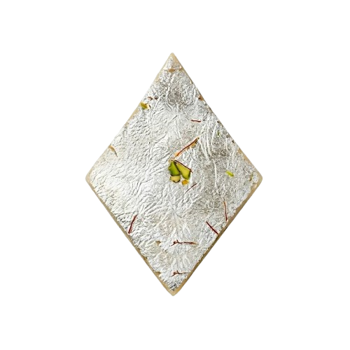

# 🟨 Kaju Barfi - Infinite Canvas App

A fast, minimal, no-nonsense canvas-based whiteboard built from scratch.

No frameworks. No backend. Just pure control.

## 🧑‍💻 Run Online

just open https://kajubarfi.netlify.app/

## 🧑‍💻 Run Locally

just open index.html

No install. No dependencies.

## 📦 Version

Current version: **3.14.0**

## ✨ Features

### 🎨 Drawing Tools
- Rectangle tool (with color editing)
- Freehand sketch tool
- Text tool (prompt-based editing)
- Eraser tool
- Image support (URL + drag & drop)

### 🧠 Smart Interaction
- Select, drag, and resize elements
- 4-corner resize system
- Lock / unlock elements (Ctrl + L)
- Duplicate elements (Ctrl + D)
- Precise movement (Ctrl + Arrow keys)

### ⚡ Quick Actions UI
- Floating toolbar near selected element
  - 🗑 Delete
  - 📋 Duplicate
  - 🔒 Lock / Unlock

### 🧭 Navigation
- Scroll → Zoom (centered)
- Space + Drag → Pan
- Keyboard zoom support

### 🎨 Customization
- Light / Dark theme toggle
- Grid modes:
  - Square grid
  - Diamond ("barfi") grid

### 💾 File System
- Save board → `.kj` file
- Load board from file
- Export as PNG

### 🖼 Image Handling
- Drag & drop images directly
- Add images via URL
- Image duplication supported
- Proper image restoration on load

## ⌨️ Keyboard Shortcuts

### Tools
| Key | Action |
|-----|--------|
| V | Select |
| R | Rectangle |
| T | Text |
| S | Sketch |
| E | Eraser |
| Esc | Back to Select |

### Actions
| Shortcut | Action |
|----------|--------|
| Ctrl + D | Duplicate |
| Ctrl + M | Lock / Unlock |
| Delete / Backspace | Delete |
| Ctrl + Z | Undo |
| Ctrl + Y | Redo |
| Ctrl + O | Open .kj file |
| Ctrl + S | Save |
| Ctrl + E | Export as png |
| Ctrl + I | Import Image by URL |

### Movement
| Shortcut | Action |
|----------|--------|
| Ctrl + Arrow | Move element |
| Ctrl + Shift + Arrow | Faster move |

### Navigation
| Action | Control |
|--------|--------|
| Zoom | Scroll |
| Pan | Space + Drag |

## 🧱 Architecture

src/ renderer/ → canvas rendering tools/ → tools (rect, sketch, text,
select) utils/ → helpers (history, export, image, settings) input/ →
keyboard handling

## ⚙️ Core Concepts

-   State-driven rendering
-   Canvas-based UI
-   No DOM-based element system
-   Undo / Redo history system
-   Theme + grid abstraction

## 💡 Design Philosophy

-   Keep it simple
-   Keep it fast
-   Avoid unnecessary abstraction
-   Full control over behavior

## ⚠️ Limitations

-   No multi-select (yet)
-   No backend sync
-   Text system is intentionally simple

## 🛠 Future Ideas

-   Box selection (multi-select)
-   Snap to grid / alignment guides
-   Color picker UI
-   Grouping system
-   Auto-save (local storage) "maybe not since I don't like it"

## 📌 Status

Actively evolving --- already usable as a lightweight whiteboard.

## 🟨 Why "Kaju Barfi"?

Because I like Kaju Barfi.

